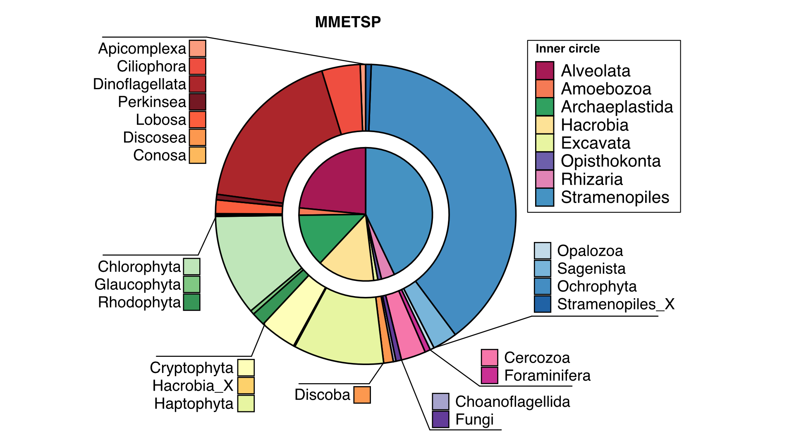
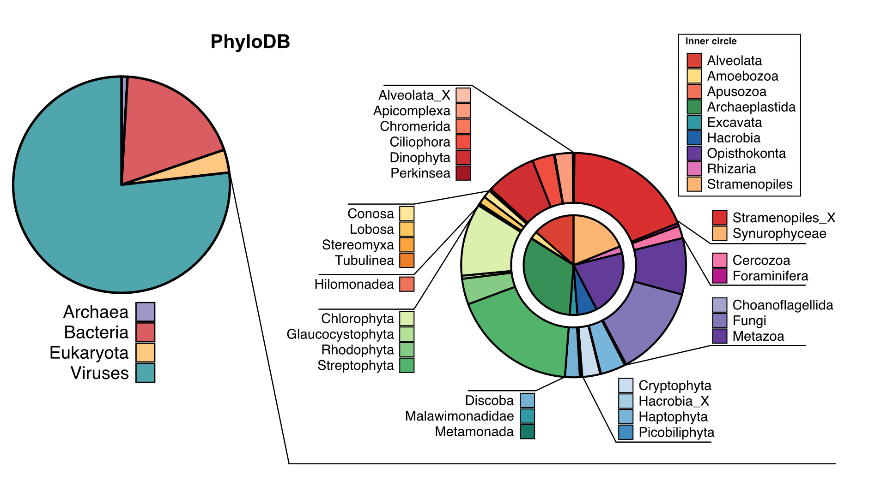
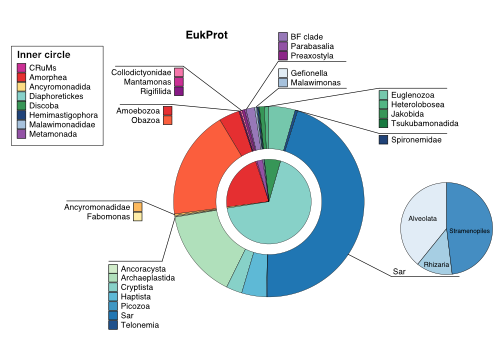
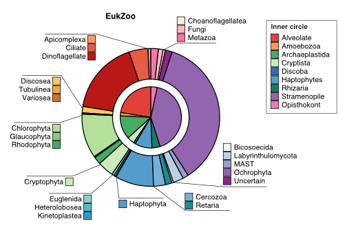

.. _databases:
   =====================================================
Installing Databases and Creating Configuration Files
=====================================================

Default Databases
-----------------

Four databases can be downloaded and formatted automatically when invoking ``EUKulele``. Currently the supported databases are:

- `PhyloDB <https://drive.google.com/drive/u/0/folders/0B-BsLZUMHrDQfldGeDRIUHNZMEREY0g3ekpEZFhrTDlQSjQtbm5heC1QX2V6TUxBeFlOejQ>`_
- `EukProt <https://figshare.com/articles/EukProt_a_database_of_genome-scale_predicted_proteins_across_the_diversity_of_eukaryotic_life/12417881/2>`_
- `MMETSP <https://zenodo.org/record/1212585#.Xw3PoJNKhTZ>`_ 
- `MMETSP <https://zenodo.org/record/1212585#.Xw3PoJNKhTZ>`_ and `MMETSP <https://mmp.sfb.uit.no/databases/marref/#/>`_ *Default*
- `EukZoo <https://github.com/zxl124/EukZoo-database>`_

Note that the MMETSP database is generated using cleaned MMETSP assemblies originally derived from, but not identical to, the assemblies stored in full at the link above. In order to download the cleaned assemblies used to create the ``EUKulele`` MMETSP database, please follow the instructions recorded in `this Github repository <https://github.com/shu251/download-cleaned-mmetsp>`_.

To use these databases, all you need to do is specify ``--database phylodb``, ``--database eukprot``, or ``--database mmetsp``, respectively, when invoking ``EUKulele``. 

A database (for example ``phylodb``) can be setup prior to running by using::

    EUKulele download --database phylodb

If a database is not found automatically by ``EUKuele`` it will automatically download the database specified by the flag. If you downloaded a database previously you can specify the ``--reference_dir`` flag indicating the path to the previously downloaded database. If no reference database is specified with ``--reference_dir``, EUKulele will automatically download and use the MMETSP database. You can also (1) download the other databases and use the flag ``reference_dir`` to point EUKulele to the location of already downloaded databases or (2) use your own databases.

Composition of Default Databases
--------------------------------

Several databases are automatically provided and formatted for ``EUKulele`` in order to let the user make the best decision. Often database choice depends on the relevant research question. Therefore, we also provide information on the contents of each database below.

Note that databases provided through ``EUKulele`` include the taxonomic structure used for the creation of the database. Therefore, the structure of the taxonomic assignment varies database to database. For instance, PhyloDB includes other microbial domains classified under "Supergroup", while the other databases only include eukaryotic references. Users should take note when they compiled downstream results from different databases. 

.. list-table:: Broad overview of each database.
      :widths: 25 12 25 13 25
   :header-rows: 1

   * - Database
     - Total entries
     - Domains
     - Unique species (strains) [*Note: not all databases have both species and strain level*]
     - Taxonomy Assignment Structure
   * - MMETSP
     - 678
     - Eukaryote
     - 316 (405)
     - Supergroup, Division, Class, Order, Family, Genus, Species, Strain
   * - PhyloDB
     - 25,992
     - Eukaryote, bacteria, archaea, virus
     - 25,992
     - Supergroup, Division, Class, Order, Family, Genus_Species
   * - EukZoo
     - 739
     - Eukaryote
     - 361 (441)
     - Supergroup, Phylum, Class, Order, Family, Genus, Species
   * - EukProt
     - 742
     - Eukaryote
     - (621)
     - Supergroup_UniEuk, Taxogroup_UniEuk, Epithet_UniEuk, Genus_UniEuk, Strain
     

  

  

  

  
Recommendations for Database Usage
----------------------------------

``EUKulele`` was initially designed for use with the MMETSP database. As this is the most complete resource for reference transcriptomes of eukaryotic species, it is the recommended database. 

A highly recommended approach is to run EUKulele with both MMETSP and PhyloDB. Since PhyloDB includes non-eukaryotic domains, a best hit eukaryotic reference from both MMETSP and PhyloDB will provide higher confidence. 

Using Other Databases
---------------------

The basic requirements for using a database with ``EUKulele`` are:

- A singular protein FASTA file containing the sequences
- A taxonomy table file which contains, for each transcriptome sample in the protein FASTA database:
    - Source_ID: what identifier/organism the transcript came from, which typically should be specified in the header within the FASTA file
    - Supergroup 
    - Division
    - Class
    - Order
    - Family
    - Genus
    - Species
- A JSON file containing a list of dictionary correspondences between each Source ID and transcript ID 
    - If you have a separate correspondence between transcript IDs and the organism each transcript ID came from, this prevents you from having to have the Source ID in the transcript header
    - Example: ``{"CAMPEP_0174983734": "MMETSP0004", "CAMPEP_0174982176": "MMETSP0004", "CAMPEP_0184404416": "MMETSP0007"}`` for a database of three transcripts coming from two different Source IDs (``MMETSP0004`` and ``MMETSP0007``)
    
These taxonomy table and JSON file can be generated using the ``create_protein_file`` script provided with ``EUKulele``. This script is invoked via::

    create-protein-table.py --infile_peptide <peptide fasta file> --infile_taxonomy <taxonomy file> --outfile_json <name of protein map JSON file> --output <name of taxonomy file> [--delim <delimiter> --column <column>] 
    
when ``EUKulele`` is installed. 

- ``--infile_peptide``
    - The peptide FASTA file for the database
- ``--infile_taxonomy``
    - The original taxonomy file
- ``--col_source_id``
    - Optional; defaults to "Source_ID"; the column in the taxonomy file that corresponds to the Source ID in the database
- ``--reformat_tax``
    - If this tag is included, the taxonomy will be split according to the contents of the column labeled with the ``taxonomy_col_id`` that is specified by the tag below (instead of 7 different columns corresponding to each taxonomic level as in the listing above)
- ``--taxonomy_col_id``
    - Only relevant if ``--reformat_tax`` is specified. The column (e.g. "taxonomy" as in the default) that contains a semicolon-separated list of the taxonomic levels to be separated into columns
- ``--outfile_json``
    - The name of the output protein map file to be created. To use the output most easily with ``EUKulele``, this file should be called ``prot-map.json`` (as is the default) and placed in the same )nce directory with the reference protein FASTA file, which ideally would be named ``reference.pep.fa`` to facilitate working with the defaults. Then, just specify this output folder as ``--reference_dir`` when invoking ``EUKulele``
- ``--output``
    - The name of the output taxonomy table file to be created. To use the output most easily with ``EUKulele``, this file should be called ``tax-table.txt`` (as is the default) and placed in the same reference directory with the reference protein FASTA file, which ideally would be named ``reference.pep.fa`` to facilitate working with the defaults. Then, just specify this output folder as ``--reference_dir`` when invoking ``EUKulele``
- ``--delim``
    - What to split the FASTA headers on in the protein database file, typically ``\t``
- ``--column``
    - The label to be used for the Source_ID parsed from the reference peptide FASTA headers. This is such that the protein map JSON file can be created from the transcript IDs. So if your transcripts include a tab-separated list of entries that includes ``SOURCE_ID=XXXXX``, as in the MMETSP, include a string here for the label before the equals sign. If instead the Source ID occurs at a predictable position in the parsed FASTA headers, a number can be included for this parameter
- ``--euk-prot``
    - Should only be used if you are specifically creating a table and protein map for the EukProt database, which has a few particular features to take into account
    
Customizing the Taxonomic Identification Cutoffs
------------------------------------------------

By default, ``EUKulele`` uses the following percent identity cutoffs to determine taxonomic matches::

    species: 95
    genus: 80
    family: 65
    order: 50
    class: 30
    
To change these cutoffs, simply create a YAML file containing these entries exactly as written above, and provide this cutoff file as input to ``EUKulele`` via ``--cutoff_file <name of YAML file you created>``. A YAML file is a Markdown document that can be used to quickly parse and deliver new variables to a script. In order to produce this YAML file, you would create a text file containing exactly the text above (i.e., line 1 would be "species: 95", or whatever you desire as a cutoff, and so on), and then save the file with the YAML extension.

