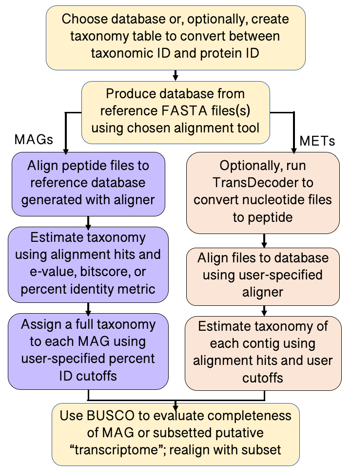

.. EUKulele documentation master file, created by
   sphinx-quickstart on Fri Aug  7 07:51:46 2020.
   You can adapt this file completely to your liking, but it should at least
   contain the root `toctree` directive.

Welcome to EUKulele's documentation!
====================================

.. toctree::
   :maxdepth: 2
   :caption: Contents
   
   quickstart
   about
   running-eukulele
   install
   databaseandconfig
   outputstructure
   tutorial
   community
   
.. toctree::
   :maxdepth: 2
   :caption: Documentation
   
   api
   parameters
   auxiliaryscripts
   
.. toctree::
   :maxdepth: 2
   :caption: Example Analyses  
   
   EUKulele_read_breakdown
   EUKulele-tuneR
   
Source Code
-----------

You can find the `source <http://github.com/AlexanderLabWHOI/EUKulele>`_ for EUKulele on GitHub.

Badging
-------

.. image:: https://coveralls.io/repos/github/AlexanderLabWHOI/EUKulele/badge.svg?branch=remodeling
   :target: https://coveralls.io/github/AlexanderLabWHOI/EUKulele?branch=remodeling

.. image:: https://travis-ci.com/AlexanderLabWHOI/EUKulele.svg?branch=master
   :target: https://travis-ci.com/AlexanderLabWHOI/EUKulele
   
Flowchart
---------

 
Caveats
-------

See :ref:`Using EUKulele<usingeukulele>` for caveats about the use of predicted proteins, rather than nucleotide contigs, for metagenomic sequences. 

Indices and tables
==================

* :ref:`genindex`
* :ref:`modindex`
* :ref:`search`

.. _GitHub: http://github.com/AlexanderLabWHOI/EUKulele
.. _Git Issues: http://github.com/AlexanderLabWHOI/EUKulele/issues
