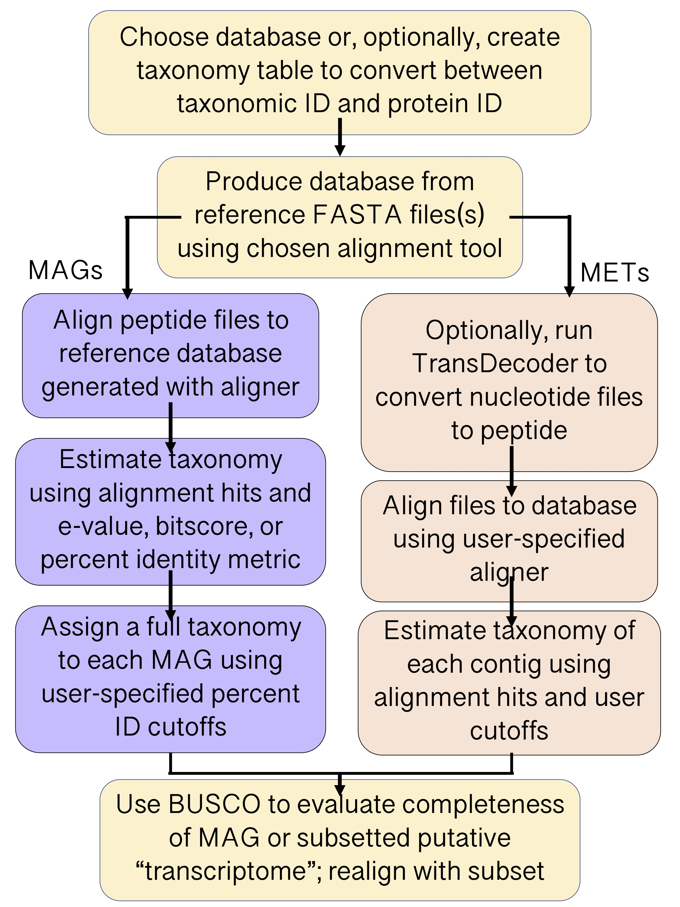

``EUKulele`` Quick Start
====================================

We recommend consulting the full documentation to explore all of the ``EUKulele`` features, capabilities, and intended usage. A quick start approach for annotating eukaryotic metagenome-assembled genomes and metatranscriptomes are outlined below using ``EUKulele``-provided databases and default parameters. 

Installation
------------

The conda installation is the most straightforward approach and the environment will contain all dependencies needed to run ``EUKulele``. If you do not already have conda installed on your machine, see the conda installation documentation `here <https://docs.conda.io/projects/conda/en/latest/user-guide/install/>`_. Other installation options are included under Installation and Invocation::

    conda create -n EUKulele
    conda activate EUKulele
    conda install -c akrinos -c bioconda -c conda-forge EUKulele

Generalized flow of EUKulele annotation
---------------------------------------

  
 
Metagenome-assembled genome (MAG) annotation
--------------------------------------------

``EUKulele`` can determine the taxonomic identity of binned MAGs using their consensus contig annotations. It run using the following command::

    EUKulele --sample_dir/output_directory -m mags

where ``output_directory`` contains one or more assembly fasta files with the extension ``.faa`` (it is recommended that MAG files are provided in protein format; see :ref:`Using EUKulele<usingeukulele>`). See :ref:`Parameters<parameters>` for other file extension accommodations. This will annotate the assemblies using the MMETSP database (default) and DIAMOND aligner (default). 

Useful output is located in:

``output/max-level-mag`` - the majority level annotation by level (supergroup - species) for each mag and the proportion of proteins that share that same annotation

``output/levels_mags`` - consensus annotations based on the majority of annotated contigs at each classification level

``output/core_taxonomy_estimation`` - contains contig annotations for core (shared) genes among MAGs as determined by BUSCO. Useful for identifying core genes among strains/variants during pangenomic analyses

``output/busco_assessment`` -  BUSCO assessment for the most abundant taxonomic annotation at each classification level. Provides information on estimated MAG completion based on conserved eukaryotic genes expected to be present in a full genome.

Metatranscriptomic (MET) annotation
-----------------------------------

``EUKulele`` can be run on metatranscriptomic assemblies using the following command:

``EUKulele --sample_dir /output_directory -m mets``

where ``output_directory`` contains one or more assembly fasta files with the extension ``.fasta``. See Parameters for other file extension accommodations. This will annotate the input assemblies using the MMETSP database (default) and DIAMOND aligner (default).

Useful output files will be located in:

``output/taxonomy_estimation`` - contains each contig’s annotation and the least common ancestor (LCA) classification threshold determined

``output/taxonomy_visualization`` - shows the breakdown of contig annotations at the seven classification levels (Supergroup, Division, Class, Order, Family, Genus, Species) for the mixed community. 

If you have any issues using ``EUKulele`` or suggestions to improve the software, please submit an `issue on GitHub <https://github.com/AlexanderLabWHOI/EUKulele/issues>`_.
