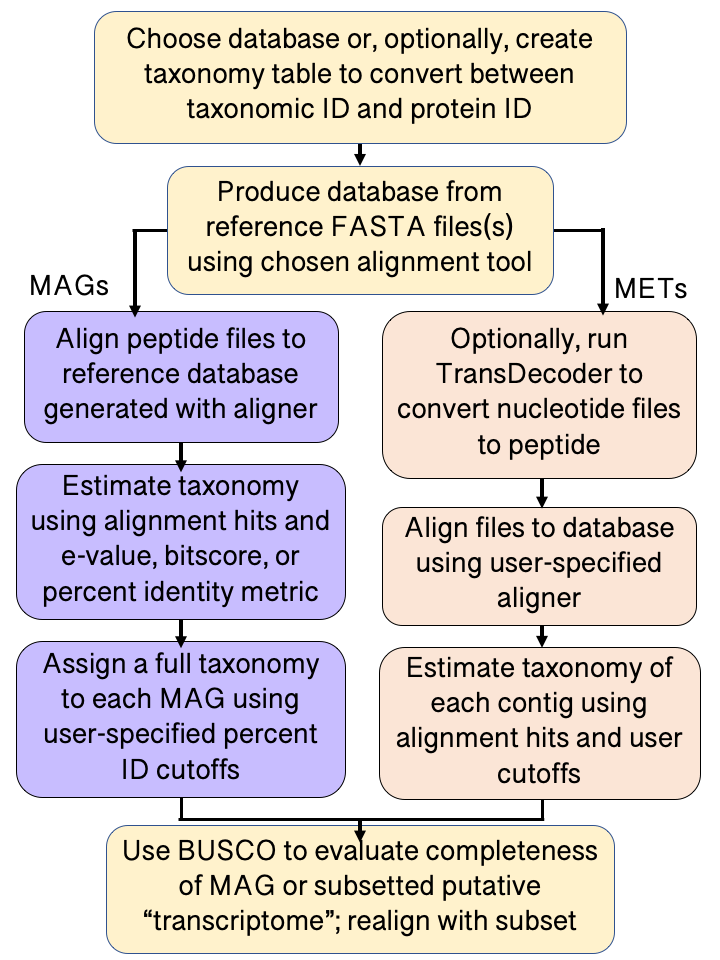

# Summary

The assessment of microbial species biodiversity is essential in ecology and evolutionary biology [@reaka1996biodiversity], but especially challenging for communities of microorganisms found in the environment [@das2006marine;@hillebrand2018climate]. Beyond providing a census of organisms in the ocean, assessing marine microbial biodiversity can reveal how microbes respond to environmental change [@salazar2017marine], clarify the ecological roles of community members [@hehemann2016adaptive], and lead to biotechnology discoveries [@das2006marine]. Computational approaches to characterize taxonomic diversity and phylogeny based on the quality of available data for environmental sequence datasets is fundamental for advancing our understanding of the role of these organisms in the environment. Even more pressing is the need for comprehensive and consistent methods to assign taxonomy to environmentally-relevant microbial eukaryotes. Here, we present `EUKulele`, an open-source software tool designed to assign taxonomy to microeukaryotes detected in meta-omic samples, and complement analysis approaches in other domains by accommodating assembly output and providing concrete metrics reporting the taxonomic completeness of each sample.

`EUKulele` is motivated by ongoing efforts in our community to create and curate databases of genetic and genomic information [@phylodb;@caron2017probing;@marineref;@richter2020eukprot]. For decades, it has been recognized that genetic and genomic techniques are key to understanding microbial diversity [@fell1992partial]. Genetic approaches are particularly useful in poorly-understood or difficult-to-access environmental systems, which may have a high degree of species diversity [@das2006marine;@mock2016bridging]. The most common approach for censusing microbial diversity is genetic barcoding, which targets the hyper-variable regions of highly conserved genes such as 16S or 18S rRNA  [@leray2016censusing]. Computational approaches to assess the origin of these barcode-based studies (or tag-sequencing) have been well established [@Bolyen2018;@schloss2009introducing], and enable biologists to compare microbial communities and estimate sequence phylogeny. The recent collation of reference databases, e.g. PR2 and EukRef, for ribosomal RNA in eukaryotes have enabled more accurate taxonomic assessment [@del2018eukref;@guillou2012protist]. However, barcoding approaches that focus on single marker genes or variable regions limit the field of view of microbes--especially protists, which have complex and highly variable genomes [@del2014others]--potentially limiting the organisms recovered and leaving the “true” diversity poorly constrained [@piganeau2011and;@caron2019we]. 

Shotgun sequencing approaches (e.g., metagenomics and metatranscriptomics) have become increasingly tractable, emerging as a  viable, untargeted means to simultaneously assess community diversity and function. Large-scale meta-omic surveys, such as the Tara Oceans project [@zhang2015tara], have presented opportunities to assemble and annotate full "genomes" from environmental metagenomic samples [@tully2018reconstruction;@Delmont2018] and assemble massive eukaryotic gene catalogs from environmental metatranscriptomic samples [@Carradec2018]. The interpretation of these meta-omic surveys hinges upon curated, culture-based reference material. Several curated databases that contain predicted proteins from a mixture of genomic and transcriptomic references from eukaryotes, as well as bacteria and archaea have been created [e.g., @phylodb;@eukzoo;@marineref;@richter2020eukprot]. Building upon the creation of high-quality reference databases, we sought to create a tool similar to MEGAN [@beier2017functional], CCMetagen [@marcelino2020ccmetagen], and MG-RAST [@keegan2016mg], but independent of NCBI databases and useful for both metagenomes and metatranscriptomes, as well as the study of environmental eukaryotes. Further, we sought to create a tool with a single function to download and format databases, which is necessary for computational tools to remain relevant and usable as reference databases grow.

{ height=50% }

## Implementation

We built a tool with default databases MMETSP [@caron2017probing], PhyloDB [@phylodb], EUKZoo [@eukzoo], MarineRefII [@marineref], and EukProt [@richter2020eukprot], for optimum compatibility with environmental eukaryotic sequences. In particular, the Marine Microbial Eukaryote Transcriptome Sequencing Project (MMETSP) database, which contains over 650 fully-assembled reference transcriptomes [@keeling2014marine;@johnson2019re], is among the largest single projects to create a unified reference. These databases are an invaluable resource yet, to our knowledge, no single integrated software tool currently exists to enable an end-user to harness databases in a consistent and reproducible manner. 

``EUKulele`` [@eukulele] (Figure \ref{fig:eukulelediagram}) is an open-source ``Python``-based package designed to simplify taxonomic identification of marine eukaryotes in meta-omic samples. The package is written in `Python`, but may be installed as a `Python` module via [PyPI](https://pypi.org/), as a standalone tool via `conda`, or through download of the `EUKulele` tarball through `GitHub`. User-provided metatranscriptomic or metagenomic samples are aligned against a database of the user's choosing, using a user-chosen aligner (``BLAST`` [@kent2002blat] or ``DIAMOND`` [@buchfink2015fast]). The "blastx" utility is used by default if metatranscriptomic samples are only provided in nucleotide format, while the "blastp" utility is used for samples available as translated protein sequences. Any consistently-formatted database may be used, but five microbial eukaryotic database options are provided by default: MMETSP [@keeling2014marine;@caron2017probing;@johnson2019re], PhyloDB [@phylodb], EukProt [@richter2020eukprot], EukZoo [@eukzoo], and a combination of the MMETSP and MarRef [@keeling2014marine;@caron2017probing;@johnson2019re;@klemetsen2018mar] (referred to as MarRef-MMETSP). This final database is the default database option, and allows the eukaryotic sequences to be compared against the expansive and high-quality MMETSP, while also distinguishing prokaryotic sequences that may be present in the sample. The package returns comma-separated files containing all of the contig matches from the metatranscriptome or metagenome, as well as the total number of transcripts that matched, at each taxonomic level, from domain or supergroup to species. If a quantification tool has been used to estimate the number of counts associated with each transcript ID, counts may also be returned. 

After a desired database is either specified by the user from a previous install, or downloaded by the program (with the MarRef-MMETSP database downloaded by default), the user-selected alignment tool will create a database from the reads in the database peptide file. That database is aligned against the sample metatranscriptomic or metagenomic reads, resulting in a transcript ID, a percentage identity, e-value, and bitscore, all of which are common metrics in bioinformatics for assessing the quality of an alignment comparison between sequences. The user can specify which metric should be used for filtering out low-quality matches.

The alignment output is compared to an accompanying phylogenetic reference specific to the database (which can be generated via a script included in the package). Taxonomy is estimated at eight levels of taxonomic resolution, labeled as they are defined in the MMETSP [@keeling2014marine] and MarRef [@klemetsen2018mar] from “species” to “domain"/"supergroup”. Additionally, the software returns barplots displaying the relative composition of each sample at each taxonomic level, according to the number of transcripts or number of estimated counts if provided from `Salmon` (an external transcript quantification tool [@patro2017salmon]), which enable users to get a quick sense of the diversity in their metagenomic or metatranscriptomic sample. For metagenomic samples, a consensus taxonomic annotation is assigned based on the majority assignment of the contigs in the metagenome-assembled genome (MAG). For the metatranscriptomic option, only the taxonomic breakdown of the mixed community detected in the assembly will be returned. 

`EUKulele` will assess the relative "completeness" of a given taxonomic group by taking a user-inputted list of names at some taxonomic level to determine BUSCO completeness and redundancy [@simao2015busco]. For example, if the user was interested whether there was a set of relatively complete contigs available for genus *Phaeocystis* within their metagenomic sample, they could pass *Phaeocystis*, along with its taxonomic level, "genus", to `EUKulele`. By default, `EUKulele` will assess the BUSCO completeness of the most commonly encountered classifications at each taxonomic level.  To do this, `BUSCO` [@simao2015busco] is used to identify the core eukaryotic genes present in each sample. Using the list of genes identified as "core", a secondary taxonomic estimation step (and consensus assignment step, for MAGs) is performed to compare the taxonomic assignment predicted using all of the genes in comparison to the assignment made using only the genes that would be expected to be found in most reference transcriptomes. This approach is particularly useful for MAGs, and offers a method for avoiding conflicting or spurious matches made due to strain-level inconsistencies. For metatranscriptome samples, BUSCO completeness can be used to estimate the completeness of taxonomic groups to better inform their downstream interpretation. 

## Statement of Need

A growing number of databases have been created to catalog eukaryotic and bacterial diversity, but even when the same database is used, taxonomic assessment is not always consistent and fully documented [@rasheed2012metagenomic;@menzel2016fast]. Databases often contain distinct compilations of organisms and custom databases are commonly compiled for only a particular study [@kranzler2019silicon;@geisen2015metatranscriptomic;@obiol2020metagenomic]. Database variability might influence interpretation by splitting taxonomic annotations between groups, and often impacts the proportion of contigs that are annotated [@price2017robust]. A software tool can bridge the gap between database availability and efficient taxonomic assessment, making environmental meta-omic analyses more reproducible. Further, such a tool can control and assess the quality of the annotation, enable inference for specific organisms or taxonomic groups, and provide more conservative annotation in the case of organisms with exceptional amounts of inter-strain variability. We have designed the `EUKulele` [@eukulele] package to enable efficient and consistent taxonomic annotation of metagenomes and metatranscriptomes, in particular for eukaryote-dominated samples.

### Future Outlook

As single species isolates continue to be sequenced, databases are growing and becoming more reliable for assigning taxonomy in diverse environmental communities. `EUKulele` provides a platform to enable the repeated and consistent linkage of these databases to metagenomic and metatranscriptomic analyses. Taxonomic annotation is not the only desired outcome of meta-omic datasets against available databases, hence we envision eventually integrating functional annotation into the `EUKulele` package.

# Acknowledgements

This software was developed with support from the Computational Science Graduate Fellowship (DOE; DE-SC0020347) awarded to AIK and from the Woods Hole Oceanographic Independent Research & Development grant awarded to HA. NRC was supported by grant 544236 from the Simons Foundation. The Center for Dark Energy Biosphere Investigations (C-DEBI; OCE-0939564) supported the participation of SKH through a C-DEBI Postdoctoral Fellowship. The High-Performance Computing cluster at Woods Hole Oceanographic Institution (Poseidon) was used to generate assemblies and run `EUKulele`.

# Author Contributions

HA and SKH conceived the original idea for the tool. HA wrote the initial code for the tool. HA and AIK refined ideas for `EUKulele` related to designing it as an installable package and adding the feature of classification via core gene taxonomy for metagenomic applications. AIK developed the Python package code, wrote the conda package, implemented multiple alignment tools, and the `BUSCO` integration. AIK, NC, SKH, and HA wrote tests and documentation. HA and AIK wrote the paper.

# References
